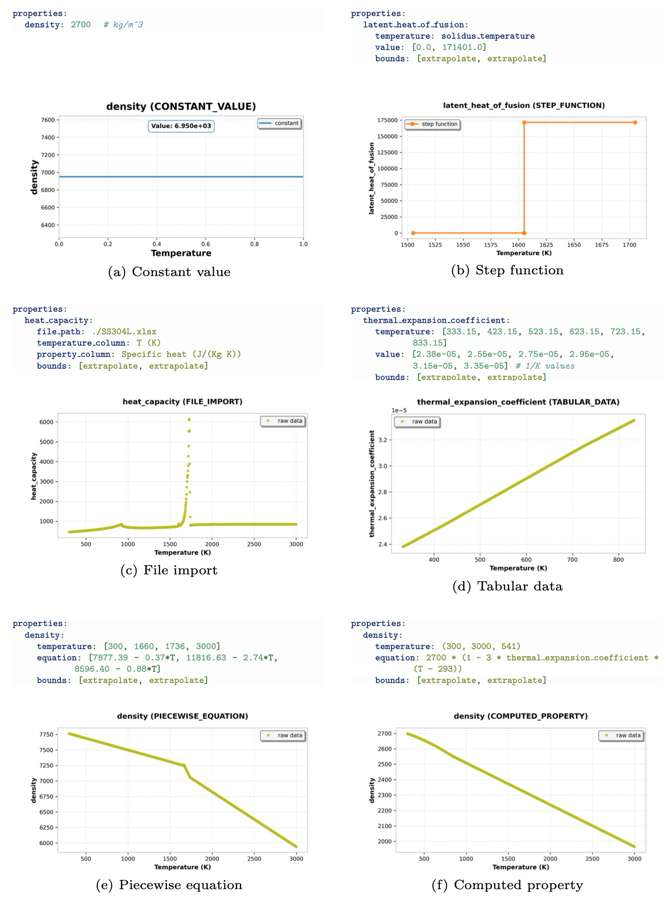

# Summary

PyMatLib is an open-source Python library that revolutionizes how scientists and engineers handle temperature-dependent material properties in computational simulations.
When materials are heated or cooled, their physical characteristics like 
thermal conductivity, density, and heat capacity change significantly. 
This creates challenges for computer simulations of processes like metal casting, heat treatment, or thermal analysis.

The library provides a simple way to define these temperature-dependent properties using YAML configuration files, 
then automatically converts them into mathematical expressions that can be used in scientific simulations. 
PyMatLib supports both pure metals and alloys, 
handles six different ways of defining properties (from simple constants to complex equations), 
and automatically manages dependencies between different material properties.

The library has been designed specifically for high-performance simulations in computational materials science 
and heat transfer applications, integrating seamlessly with existing scientific computing workflows.

# Statement of Need

Accurate representation of temperature-dependent material properties is fundamental to computational materials science, 
thermal analysis, and multi-physics simulations [@lewis1996finite; @zienkiewicz2013finite]. 
Traditional approaches often require manual interpolation, custom scripting, 
or proprietary software solutions that lack flexibility and reproducibility [@ashby2013materials]. 
Existing materials databases like NIST [@nist_webbook] and CoolProp [@coolprop] typically provide tabular data 
without integrated processing capabilities, forcing researchers to implement ad-hoc solutions for each simulation framework.

While established tools like CoolProp [@coolprop] and NIST databases [@nist_webbook] provide comprehensive thermodynamic data, 
they lack integrated symbolic processing and dependency resolution capabilities. 
CoolProp focuses on fluid properties with limited solid material support and no symbolic integration, 
while NIST WebBook provides tabular data without processing capabilities or dependency management. 
CALPHAD databases [@lukas2007computational] require specialized software and lack integration with general-purpose simulation codes. 
Custom implementations often lack validation, reproducibility, and standardized interfaces.

# Key Features

PyMatLib addresses critical gaps in material science software by providing a standardized, extensible framework 
that offers unprecedented flexibility in material property definition through several innovative capabilities:

- **Flexible Input Methods**: The library supports six different property definition methods 
(constant values, step functions, file-based data, key-value pairs, piecewise equations, and computed properties), 
allowing users to choose the most appropriate format for their data sources and modeling requirements (\autoref{fig:input_methods}).
File-based data processing leverages pandas [@pandas] for robust handling of various formats 
including Excel (.xlsx), CSV, and text files with comprehensive missing value detection, data cleaning, duplicate removal, and validation.



- **Universal Material Support**: The framework supports both pure metals and alloys through a unified interface,
with extensibility for additional material types.
Pure metals use melting/boiling temperatures, while alloys use solidus/liquidus temperature ranges.

- **Robust Data Quality Assurance**: Built-in data validation includes duplicate temperature removal,
missing value handling with configurable thresholds, automatic data sorting, 
and support for various file encodings and missing value representations commonly found in experimental datasets. 
This ensures data integrity and prevents common errors in materials property processing.

- **Optional Data Simplification**: The library supports regression-based data simplification using pwlf [@pwlf] for large complex datasets,
allowing users to reduce computational overhead and memory usage while maintaining accuracy.
Piecewise linear fitting with configurable polynomial degrees enables efficient approximation of complex property relationships
while preserving essential physical behavior (\autoref{fig:regression_options}).


- **Intelligent Simplification Timing**: PyMatLib provides sophisticated control over when data simplification occurs in the dependency chain 
through the `simplify` parameter (`pre` or `post`). When set to `pre`, properties are simplified before being passed to dependent properties, 
optimizing computational performance for complex dependency networks. 
When set to `post`, the raw piecewise function with all data points is preserved during dependency resolution, 
with simplification applied only after all dependent calculations are complete. 
This ensures maximum accuracy in interdependent property calculations while still providing the benefits of data simplification. 
This timing control allows users to balance computational efficiency with numerical accuracy based on their specific simulation requirements.
Here is an example configuration for regression and simplification options in PyMatLib:

```yaml
    regression:      # Optional regression configuration
      simplify: pre  # 'pre' (before processing) or 'post' (after processing)
      degree: 2      # Polynomial degree for regression
      segments: 3    # Number of piecewise segments

```

- **Configurable Boundary Behavior**: Users can specify how properties behave outside defined temperature ranges, 
choosing between constant extrapolation or linear extrapolation based on their physical understanding of the material 
(\autoref{fig:boundary_behavior}).

```yaml
    bounds: [constant, extrapolate]  # Boundary behavior: 'constant' or 'extrapolate'
```


- **Automatic Dependency Resolution**: Intelligent processing order determination for computed properties ensures 
mathematical dependencies are resolved correctly without manual intervention. 
The library automatically detects circular dependencies and provides clear error messages for invalid configurations.

- **Bidirectional Property-Temperature Conversion**: The library automatically generates inverse piecewise functions enabling 
temperature = f(property) calculations alongside the standard property = f(temperature) relationships. 
This bidirectional capability is essential for energy-based numerical methods [@voller1987fixed], phase-change simulations, 
and iterative solvers where temperature must be determined from known property values.
The inverse function generation supports linear piecewise segments 
(either through default linear interpolation or explicit degree=1 regression), ensuring robust mathematical invertibility.

- **Built-in Validation Framework**: Built-in validation ensures YAML configuration correctness, including composition sum verification, 
required field checking for pure metals versus alloys, property name validation, and regression parameter bounds checking. 
This prevents common configuration errors and ensures reproducible material definitions [@roache1998verification].

- **Integrated Visualization**: Automatic plot generation enables users to verify their material definitions visually,
with the option to disable visualization for production workflows after validation.

```python
    import sympy as sp
    from pymatlib.parsing.api import create_material
    
    # Create a material with symbolic temperature and enable plotting
    T = sp.Symbol('T')
    material_T = create_material('path/to/material.yaml', T, enable_plotting=True)
```

Unlike existing tools, PyMatLib uniquely combines symbolic mathematics [@sympy], automatic dependency resolution, 
and seamless integration with scientific computing workflows [@numpy; @matplotlib]. 
The library integrates directly with simulation frameworks like 
pystencils [@pystencils] and waLBerla [@walberla] for high-performance computing applications. 
PyMatLib is open-source, distributed under the BSD-3-Clause license.
Code and documentation to use this package are available on [GitHub](https://github.com/rahildoshi97/pymatlib/tree/master).

# Example YAML Configuration

PyMatLib uses a YAML-based configuration system for defining material properties,
allowing users to specify properties in a human-readable format.
The YAML files can include pure metals with melting/boiling temperatures or alloys with solidus/liquidus temperature ranges.

## Pure Metal Example
```yaml
# =================================================
# PYMATLIB MATERIAL CONFIGURATION FILE - PURE METAL
# =================================================

name: Aluminum
material_type: pure_metal

# Composition must sum to 1.0 (for pure metals, single element = 1.0)
composition:
  Al: 1.0  # Aluminum

# Required temperature properties for pure metals
melting_temperature: 933.47  # Solid becomes liquid (K)
boiling_temperature: 2743.0  # Liquid becomes gas (K)

properties:  
    density:
        temperature: (300, 3000, 541)
        equation: 2700 * (1 - 3*thermal_expansion_coefficient * (T - 293))
        bounds: [constant, constant]
```

## Alloy Example
```yaml
# ============================================
# PYMATLIB MATERIAL CONFIGURATION FILE - ALLOY
# ============================================

name: Stainless Steel 304L
material_type: alloy

# Composition fractions must sum to 1.0
composition:
Fe: 0.675  # Iron
Cr: 0.170  # Chromium
Ni: 0.120  # Nickel
Mo: 0.025  # Molybdenum
Mn: 0.010  # Manganese

# Required temperature properties for alloys
solidus_temperature: 1605.          # Melting begins (K)
liquidus_temperature: 1735.         # Melting is completely melted (K)
initial_boiling_temperature: 3090.  # Boiling begins (K)
final_boiling_temperature: 3200.    # Material is completely vaporized (K)

properties:
    density:
        file_path: ./SS304L.xlsx
        temperature_header: T (K)
        value_header: Density (kg/(m)^3)
        bounds: [constant, extrapolate]
        regression:  # Optional regression configuration
            simplify: pre  # Simplify before processing
            degree: 2      # Use quadratic regression for simplification
            segments: 3    # Fit with 3 segments for piecewise linear approximation

    thermal_expansion_coefficient:
      temperature: [333.15, 423.15, 523.15, 623.15, 723.15, 833.15]
      value: [2.38e-05, 2.55e-05, 2.75e-05, 2.95e-05, 3.15e-05, 3.35e-05] # 1/K values
      bounds: [extrapolate, extrapolate]

    density:
      temperature: [300, 1660, 1736, 3000]
      equation: [7877.39 - 0.37*T, 11816.63 - 2.74*T, 8596.40 - 0.88*T]
      bounds: [extrapolate, extrapolate]
```

Complete YAML configurations are provided in the PyMatLib documentation for both 
[pure metals](https://github.com/rahildoshi97/pymatlib/blob/master/src/pymatlib/data/materials/pure_metals/Al/Al.yaml) and 
[alloys](https://github.com/rahildoshi97/pymatlib/blob/master/src/pymatlib/data/materials/alloys/SS304L/SS304L.yaml).

# Research Applications

The library can be applied in research projects involving alloy design 
and optimization with accurate representation of solidus-liquidus temperature ranges [@callister2018materials], 
energy-based finite element methods for thermal analysis [@hughes2012finite], 
multiscale simulations linking molecular dynamics with continuum mechanics [@tadmor2011modeling], 
and high-performance computing applications in computational fluid dynamics and heat transfer modeling. 
Its YAML-based configuration system, powered by ruamel.yaml parsing [@ruamel-yaml], supports the FAIR principles [@wilkinson2016fair] for scientific data management, 
enabling reproducible research across different simulation codes and research groups.

# Comparison with Existing Tools

| Feature                  | PyMatLib      | CoolProp | NIST WebBook | CALPHAD |
|:-------------------------|:--------------|:---------|:-------------|:--------|
| **Core Capabilities**    |
| Symbolic Integration     | Yes           | No       | No           | No      |
| Dependency Resolution    | Yes           | No       | No           | No      |
| Multiple Input Methods   | Yes (6 types) | No       | No           | No      |
| **Material Support**     |
| Solid Materials          | Yes           | Limited  | Yes          | Yes     |
| Custom Properties        | Yes           | No       | No           | Limited |
| Temperature Dependencies | Yes           | Yes      | Yes          | Yes     |
| **Accessibility**        |
| Open Source              | Yes           | Yes      | No           | No      |
| Python Integration       | Native        | Yes      | API only     | No      |

**Key Advantage**: PyMatLib is the only tool that combines symbolic mathematics with intelligent dependency resolution, 
enabling seamless integration with simulation frameworks while maintaining scientific reproducibility.

# Acknowledgements

The development of PyMatLib was supported by the Friedrich-Alexander-Universität Erlangen-Nürnberg. 
We acknowledge the contributions of the SymPy [@sympy], NumPy [@numpy], pandas [@pandas], matplotlib [@matplotlib],
and ruamel.yaml [@ruamel-yaml] development communities, whose libraries provide 
the symbolic mathematics, numerical computing, data processing, visualization, and configuration parsing capabilities 
that form the foundation of PyMatLib.

# References
