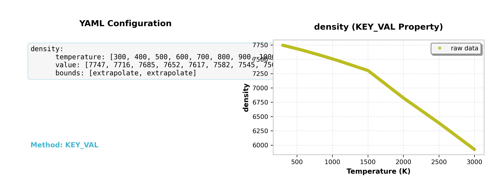
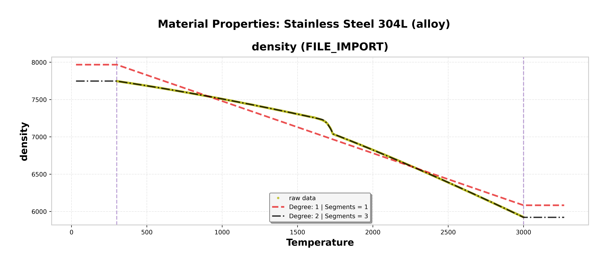

# Summary

PyMatLib is a Python library that revolutionizes how scientists and engineers handle temperature-dependent material properties in computational simulations.
Traditional approaches require manual interpolation, custom scripting, or proprietary software solutions that lack flexibility and reproducibility.
PyMatLib addresses this through a unified framework that combines symbolic mathematics, automatic dependency resolution, and flexible data input methods.

The library transforms complex material property relationships into mathematical expressions suitable for high-performance simulations,
supporting both pure metals and alloys through intuitive YAML configuration files.
With six different property definition methods and intelligent processing capabilities,
PyMatLib enables researchers to focus on physics rather than data management, integrating seamlessly with existing scientific computing workflows.

# Statement of Need

Accurate representation of temperature-dependent material properties is fundamental to computational materials science, thermal analysis,
and multi-physics simulations [@lewis1996finite; @zienkiewicz2013finite]. However, existing solutions suffer from critical limitations:

**Data Integration Challenges**: Researchers must manually interpolate tabular data from sources like NIST [@nist_webbook]
or implement custom solutions for each simulation framework, creating barriers to reproducible research [@ashby2013materials].

**Lack of Dependency Management**: Complex property relationships (e.g., thermal diffusivity depending on conductivity,
density, and heat capacity) require manual ordering and validation, leading to error-prone implementations.

**Limited Symbolic Integration**: Most tools like CoolProp [@coolprop] provide only numerical values,
preventing symbolic manipulation required for analytical methods and automatic differentiation in advanced simulation codes.

**Reproducibility Issues**: Custom implementations lack standardization and validation,
making it difficult to reproduce results across different research groups and simulation frameworks.

PyMatLib addresses these challenges by providing the first comprehensive framework that combines symbolic mathematics
with intelligent property processing, enabling reproducible and efficient material property management in scientific simulations.

# Software Architecture

PyMatLib's architecture is built around a modular design that separates concerns while maintaining flexibility and extensibility:

**Core Components**: The library consists of material definition parsers, property processors, dependency resolvers, and validation frameworks that work together seamlessly.

**Handler Pattern**: Six specialized handlers process different property definition methods
(constant, step, file, key-value, piecewise, computed), each optimized for specific data types and use cases.

**Dependency Graph**: An intelligent topological sorting algorithm automatically determines processing order for computed properties,
detecting circular dependencies and providing clear error messages.

**Integration Layer**: Direct integration with SymPy [@sympy] for symbolic mathematics, pandas [@pandas] for data processing,
and matplotlib [@matplotlib] for visualization ensures compatibility with the broader scientific Python ecosystem.

# Key Features

## Flexible Input Methods

PyMatLib supports six different property definition methods, allowing users to choose the most appropriate format for their data sources:

**Constant Values**: Simple properties that don't change with temperature
**Step Functions**: Discrete property changes at specific temperatures (e.g., phase transitions)
**File-Based Data**: Support for Excel (.xlsx), CSV, and text files with comprehensive data validation
**Key-Value Pairs**: Experimental data points with automatic interpolation
**Piecewise Equations**: Complex mathematical relationships with conditional logic
**Computed Properties**: Dependencies on other properties with automatic resolution

## Advanced Processing Capabilities

**Regression-Based Simplification**: Optional data reduction using pwlf [@pwlf] for large datasets,
with configurable polynomial degrees and segment numbers to balance accuracy and computational efficiency.

**Intelligent Timing Control**: The `simplify` parameter (`pre` or `post`) controls when data simplification occurs in the dependency chain,
allowing users to optimize either computational performance or numerical accuracy.

**Boundary Behavior Configuration**: Users can specify constant or linear extrapolation outside defined temperature ranges based on their physical understanding of the material.

**Bidirectional Conversion**: Automatic generation of inverse piecewise functions enables temperature = f(property) calculations alongside standard
property = f(temperature) relationships, essential for energy-based numerical methods [@voller1987fixed].





**Integrated Visualization**: Automatic plot generation enables users to verify their material definitions visually,
with the option to disable visualization for production workflows after validation.

# Implementation Details

## Core Algorithms

**Piecewise Function Construction**: SymPy-based piecewise functions with configurable boundary conditions
enable accurate representation of complex temperature-dependent relationships while maintaining symbolic manipulability.

**Dependency Resolution**: The library uses graph-based algorithms to automatically determine processing order,
ensuring mathematical dependencies are resolved correctly without manual intervention.

**Data Validation Framework**: Comprehensive validation includes monotonicity checking for physical consistency,
composition sum verification for alloys, missing value handling with configurable thresholds, and duplicate removal.

**Inverse Function Generation**: Automatic generation of mathematically invertible functions supports bidirectional property-temperature conversion,
crucial for iterative solvers and energy-based methods.

## Performance Optimizations

**Memory Management**: Regression-based data simplification reduces memory footprint for large datasets while maintaining essential physical behavior.

**Computational Efficiency**: Strategic simplification timing and caching mechanisms optimize performance for complex dependency networks.

**Error Handling**: Robust validation prevents common configuration errors and provides clear diagnostic messages for debugging.




# Usage Examples

## YAML Configuration Example
```yaml
# ====================================================================================================
# PYMATLIB MATERIAL CONFIGURATION FILE
# ====================================================================================================
# This file defines material properties for Stainless Steel 304L using the new pymatlib format.
# Pymatlib supports 6 property types: CONSTANT, STEP_FUNCTION, FILE, KEY_VAL, PIECEWISE_EQUATION, and COMPUTE
#
# IMPORTANT: All property configurations must include 'bounds' parameter (except CONSTANT properties)
# ====================================================================================================

name: Stainless Steel 304L
material_type: alloy  # Must be 'alloy' or 'pure_metal'

# Composition fractions must sum to 1.0
composition:
Fe: 0.675
Cr: 0.170
Ni: 0.120
Mo: 0.025
Mn: 0.01

# Required temperature properties for alloys
solidus_temperature: 1605.          # Temperature where melting begins (K)
liquidus_temperature: 1735.         # Temperature where material is completely melted (K)
initial_boiling_temperature: 3090.  # Temperature where boiling begins (K)
final_boiling_temperature: 3200.    # Temperature where material is completely vaporized (K)

properties:

# ====================================================================================================
# PROPERTY TYPE 1: CONSTANT
# Format: property_name: numeric_value
# Note: Must be float, not integer (use 1.0 instead of 1)
# ====================================================================================================

latent_heat_of_vaporization: 1.71401E5  # J/kg - Scientific notation supported

# ====================================================================================================
# PROPERTY TYPE 2: STEP_FUNCTION
# Format: Uses 'temperature' (single reference) and 'value' (list of 2 values)
# Supports temperature references and arithmetic expressions
# ====================================================================================================

# Example with temperature reference arithmetic:
# latent_heat_of_fusion:
#   temperature: solidus_temperature - 1 # Arithmetic expressions supported
#   value: [0.0, 171401.0]               # [before_transition, after_transition]
#   bounds: [constant, constant]         # Required for all non-constant properties

# ====================================================================================================
# PROPERTY TYPE 3: KEY_VAL
# Format: Uses 'temperature' (list/tuple) and 'value' (list) with same length
# Supports temperature references, explicit lists, and tuple notation
# ====================================================================================================

latent_heat_of_fusion:
temperature: [solidus_temperature - 1, liquidus_temperature + 1]  # Temperature references with arithmetic
value: [0, 171401.]                    # Corresponding property values
bounds: [constant, constant]           # Boundary behavior: 'constant' or 'extrapolate'

thermal_expansion_coefficient:
temperature: [300, 400, 500, 600, 700, 800, 900, 1000, 1100, 1500, 2000, 2500, 3000]
value: [1.2632e-5, 1.468e-5, 1.524e-5, 1.581e-5, 1.639e-5, 1.699e-5, 1.759e-5, 1.821e-5, 1.885e-5, 2.1e-5, 2.3e-5, 2.5e-5, 2.7e-5]
bounds: [constant, constant]
regression:                            # Optional regression configuration
simplify: pre                        # 'pre' (before processing) or 'post' (after processing)
degree: 1                            # Polynomial degree for regression
segments: 2                          # Number of piecewise segments

# ====================================================================================================
# PROPERTY TYPE 4: FILE
# Format: Uses 'file_path', 'temperature_header', 'value_header'
# Supports .txt, .csv, .xlsx files with automatic missing value handling
# ====================================================================================================

heat_capacity:
file_path: ./SS304L.xlsx               # Relative path from YAML file location
temperature_header: T (K)              # Column name for temperature data
value_header: Specific heat (J/(Kg K)) # Column name for property data
bounds: [constant, constant]           # Required boundary behavior
regression:                            # Optional regression for data simplification
simplify: pre                        # Apply regression before processing
degree: 1                            # Linear regression
segments: 4                          # Divide into 4 piecewise segments

density:
file_path: ./SS304L.xlsx
temperature_header: T (K)
value_header: Density (kg/(m)^3)
bounds: [constant, constant]
regression:
simplify: post                       # Apply regression after processing
degree: 2
segments: 3

# ====================================================================================================
# PROPERTY TYPE 5: PIECEWISE_EQUATION
# Format: Uses 'temperature' (breakpoints) and 'equation' (list of expressions)
# Number of equations = number of breakpoints - 1
# ====================================================================================================

heat_conductivity:
temperature: [500, 1700, 3000]         # Temperature breakpoints (K)
equation: [0.0124137215440647*T + 13.0532171803243, 0.0124137215440647*T + 13.0532171803243]
# Two equations for three breakpoints: [500-1700K] and [1700-3000K]
bounds: [constant, constant]           # Boundary behavior outside range
regression:
simplify: post                       # Apply regression after symbolic processing
degree: 1
segments: 2

# ====================================================================================================
# PROPERTY TYPE 6: COMPUTE
# Format: Uses 'equation' (single expression) and 'temperature' (range definition)
# Supports dependency resolution and automatic ordering
# ====================================================================================================

specific_enthalpy:
temperature: (300, 3000, 541)          # (start, stop, num_points) - 541 evenly spaced points
equation: Integral(heat_capacity, T)   # Symbolic integration
bounds: [constant, constant]
regression:
simplify: post
degree: 1
segments: 2

energy_density:
temperature: (300, 3000, 5.0)          # (start, stop, step) - 5K increments
equation: density * specific_enthalpy  # Property dependencies automatically resolved
bounds: [extrapolate, extrapolate]
regression:
simplify: pre
degree: 1
segments: 6

thermal_diffusivity:
temperature: (3000, 300, -5.0)         # (start, stop, negative_step) - decreasing temperature
equation: heat_conductivity /(density * heat_capacity)  # Multi-property dependency
bounds: [constant, constant]
regression:
simplify: post
degree: 1
segments: 3

# ====================================================================================================
# TEMPERATURE DEFINITION FORMATS:
#
# 1. Single value: 1000.0
# 2. List: [300, 400, 500, 600]
# 3. Temperature references: solidus_temperature, liquidus_temperature, etc.
# 4. Arithmetic expressions: melting_temperature + 50, solidus_temperature - 10
# 5. Tuple formats:
#    - (start, increment): (300, 50) with n_values parameter
#    - (start, stop, step): (300, 1000, 10.0) for 10K increments
#    - (start, stop, points): (300, 1000, 71) for 71 evenly spaced points
#
# BOUNDS OPTIONS:
# - 'constant': Use boundary values as constants outside range
# - 'extrapolate': Linear extrapolation outside range
#
# REGRESSION OPTIONS:
# - simplify: 'pre' (before symbolic processing) or 'post' (after symbolic processing)
# - degree: Polynomial degree (1=linear, 2=quadratic, etc.)
# - segments: Number of piecewise segments for regression
# ====================================================================================================
```

# Research Applications

## Computational Materials Science

PyMatLib enables accurate modeling of phase transformations, solidification processes, and thermal processing in materials research.
The library's support for solidus-liquidus temperature ranges makes it particularly valuable for alloy design and optimization studies [@callister2018materials].

## Finite Element Analysis

Energy-based finite element methods for thermal analysis benefit from PyMatLib's symbolic integration capabilities and
bidirectional property-temperature conversion [@hughes2012finite].
The library integrates seamlessly with simulation frameworks like pystencils [@pystencils] and waLBerla [@walberla].

## Multi-Physics Simulations

Complex simulations linking molecular dynamics with continuum mechanics require accurate property relationships across multiple scales [@tadmor2011modeling].
PyMatLib's dependency resolution ensures consistency in coupled property calculations.

## High-Performance Computing

The library's symbolic mathematics foundation enables automatic code generation and optimization for parallel computing environments,
supporting large-scale computational fluid dynamics and heat transfer applications.

# Comparison with Existing Tools

## **Core Capabilities**

| Feature | PyMatLib | CoolProp | NIST WebBook | CALPHAD | Thermo-Calc | Custom Scripts | Materials Project |
| :-- | :-- | :-- | :-- | :-- | :-- | :-- | :-- |
| Symbolic Integration | ✓ | ✗ | ✗ | ✗ | ✗ | Limited | ✗ |
| Dependency Resolution | ✓ | ✗ | ✗ | ✗ | ✗ | Manual | ✗ |
| Temperature-Dependent Properties | ✓ | ✓ | ✓ | ✓ | ✓ | ✓ | Limited |
| Bidirectional Conversion | ✓ | Limited | ✗ | ✗ | ✗ | Manual | ✗ |
| Automatic Differentiation | ✓ | ✗ | ✗ | ✗ | ✗ | Manual | ✗ |
| Mathematical Expression Generation | ✓ | ✗ | ✗ | ✗ | ✗ | Manual | ✗ |
| Property Interpolation | ✓ | ✓ | Manual | ✓ | ✓ | Manual | ✗ |

## **Material Support**

| Feature | PyMatLib | CoolProp | NIST WebBook | CALPHAD | Thermo-Calc | Custom Scripts | Materials Project |
| :-- | :-- | :-- | :-- | :-- | :-- | :-- | :-- |
| Pure Metals | ✓ | Limited | ✓ | ✓ | ✓ | ✓ | ✓ |
| Alloys | ✓ | ✗ | Limited | ✓ | ✓ | ✓ | ✓ |
| Solid Materials Focus | ✓ | ✗ | ✓ | ✓ | ✓ | Variable | ✓ |
| Fluids | ✗ | ✓ | ✓ | Limited | ✓ | Variable | ✗ |
| Custom Material Definition | ✓ | ✗ | ✗ | Limited | ✗ | ✓ | ✗ |
| Phase Transition Handling | ✓ | ✓ | Manual | ✓ | ✓ | Manual | Limited |
| Solidus/Liquidus Support | ✓ | ✗ | ✗ | ✓ | ✓ | Manual | ✗ |
| Material Database Size | Custom | 122 fluids | 40,000+ compounds | 1000+ systems | 5000+ systems | Unlimited | 130,000+ materials |

## **Data Handling**

| Feature | PyMatLib | CoolProp | NIST WebBook | CALPHAD | Thermo-Calc | Custom Scripts | Materials Project |
| :-- | :-- | :-- | :-- | :-- | :-- | :-- | :-- |
| Multiple Input Formats | ✓ (6 types) | ✗ | ✗ | ✗ | ✗ | Variable | ✗ |
| File Format Support | Excel, CSV, TXT | ✗ | ✗ | DAT, TDB | TDB, POP | All | JSON, CSV |
| Data Validation | ✓ | ✓ | ✗ | ✓ | ✓ | Variable | ✓ |
| Regression Capabilities | ✓ (pwlf) | ✗ | ✗ | ✗ | ✗ | Manual | ✗ |
| Missing Value Handling | ✓ | ✗ | ✗ | ✗ | ✗ | Manual | ✗ |
| Duplicate Detection | ✓ | N/A | ✗ | ✗ | ✗ | Manual | ✗ |
| Data Cleaning | ✓ | ✗ | ✗ | ✗ | ✗ | Manual | ✗ |
| Boundary Behavior Control | ✓ | ✓ | ✗ | ✗ | ✗ | Manual | ✗ |

## **Integration \& Usability**

| Feature | PyMatLib | CoolProp | NIST WebBook | CALPHAD | Thermo-Calc | Custom Scripts | Materials Project |
| :-- | :-- | :-- | :-- | :-- | :-- | :-- | :-- |
| Open Source | ✓ | ✓ | ✗ | ✗ | ✗ | ✓ | ✓ |
| Python Integration | ✓ | ✓ | API only | ✗ | Limited | ✓ | ✓ |
| Language Support | Python | 10+ languages | Web/API | Fortran/C++ | GUI/API | Any | Python/Web |
| Visualization | ✓ | Limited | ✗ | ✗ | ✓ | Manual | ✓ |
| Configuration Files | ✓ (YAML) | ✗ | ✗ | ✗ | ✗ | Variable | ✗ |
| Documentation Quality | ✓ | ✓ | ✓ | ✓ | ✓ | Variable | ✓ |
| Learning Curve | Low | Medium | Low | High | High | Variable | Medium |
| Installation Complexity | pip install | pip install | Web-based | Complex | License + Install | Variable | pip install |

## **Scientific Computing**

| Feature | PyMatLib | CoolProp | NIST WebBook | CALPHAD | Thermo-Calc | Custom Scripts | Materials Project |
| :-- | :-- | :-- | :-- | :-- | :-- | :-- | :-- |
| Reproducibility | ✓ | ✓ | Limited | Limited | Limited | Variable | ✓ |
| Version Control Support | ✓ | ✓ | ✗ | ✗ | ✗ | ✓ | ✓ |
| HPC Integration | ✓ | ✓ | ✗ | ✗ | ✗ | ✓ | Limited |
| Simulation Framework Support | ✓ | ✓ | ✗ | ✗ | ✗ | ✓ | Limited |
| Parallel Processing | ✓ | ✓ | ✗ | ✗ | ✗ | Manual | ✗ |
| Unit Testing | ✓ | ✓ | N/A | ✗ | ✗ | Variable | ✓ |
| Continuous Integration | ✓ | ✓ | N/A | ✗ | ✗ | Variable | ✓ |
| Performance Optimization | ✓ | ✓ | N/A | ✓ | ✓ | Manual | ✓ |
| Memory Efficiency | ✓ | ✓ | N/A | ✓ | ✓ | Variable | ✓ |
| Numerical Stability | ✓ | ✓ | N/A | ✓ | ✓ | Variable | ✓ |

PyMatLib uniquely combines the flexibility of custom solutions with the reliability of established databases,
while adding sophisticated symbolic processing capabilities not found in existing tools.

# Limitations and Future Work

## Current Limitations

**Material Scope**: Currently focused on metallic materials, with plans to extend to ceramics, polymers, and composites.

**Property Range**: Limited to thermal and mechanical properties, with expansion to electrical and magnetic properties planned.

**Validation Coverage**: While comprehensive, validation against experimental data could be expanded for more material systems.

## Future Development

**Extended Material Types**: Support for composite materials, ceramics, and polymers with appropriate property models.

**Advanced Analytics**: Integration with machine learning tools for property prediction and uncertainty quantification.

**Simulation Integration**: Enhanced connectors for popular simulation frameworks including FEniCS, OpenFOAM, and COMSOL.

**Database Integration**: Direct connections to materials databases for automated property retrieval and validation.

# Acknowledgements

The development of PyMatLib was supported by the Friedrich-Alexander-Universität Erlangen-Nürnberg.
We acknowledge the contributions of the SymPy [@sympy], NumPy [@numpy], pandas [@pandas], matplotlib [@matplotlib],
and ruamel.yaml [@ruamel-yaml] development communities, whose libraries provide
the symbolic mathematics, numerical computing, data processing, visualization, and configuration parsing capabilities
that form the foundation of PyMatLib.

# References
